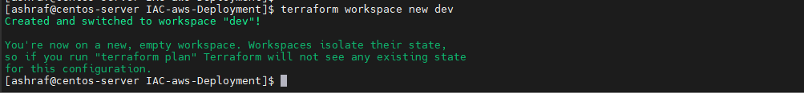
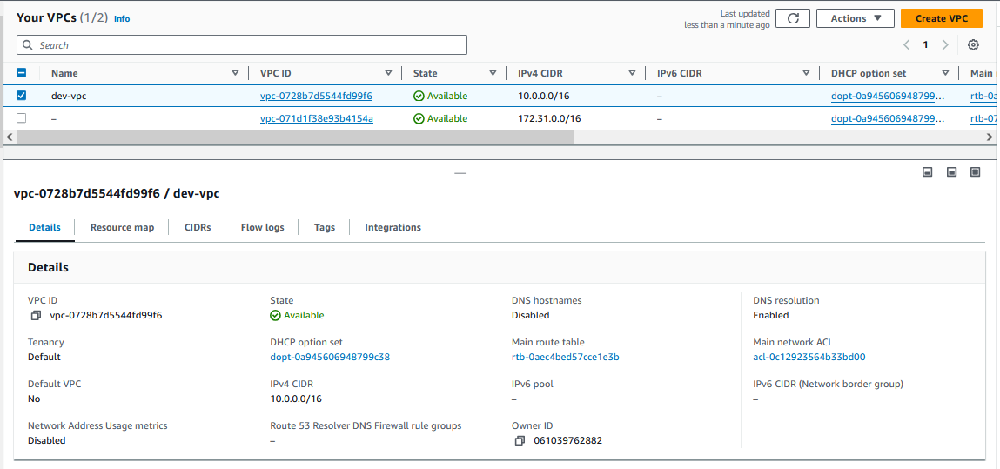
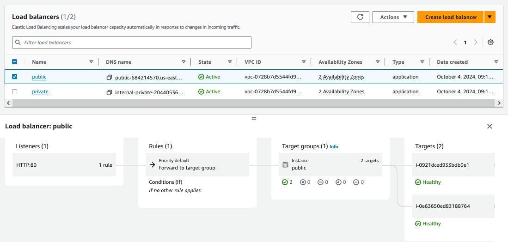
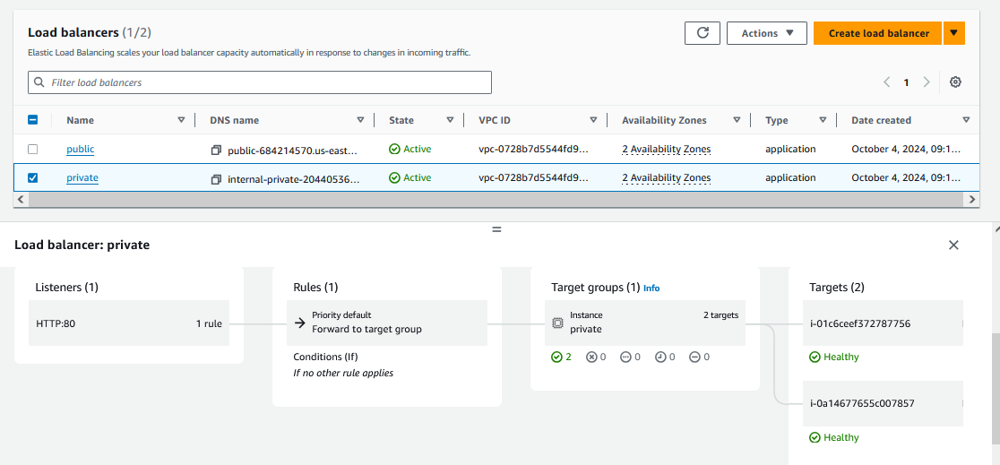
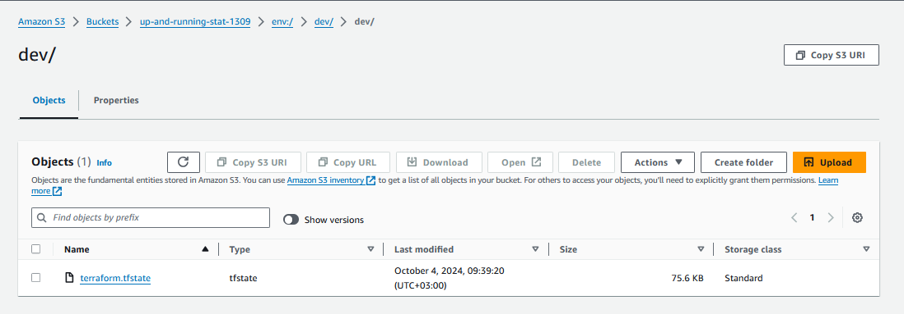
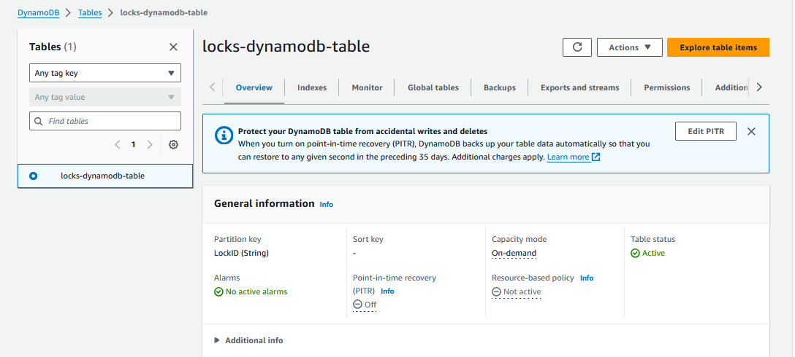
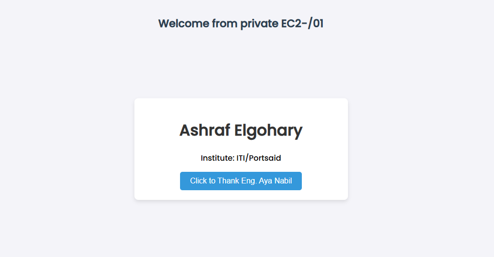
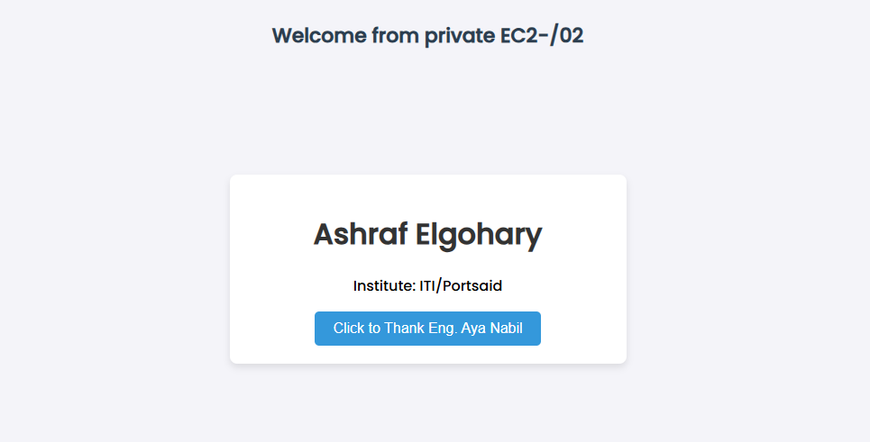

# IAC-AWS-Deployment

## Project Description

This Terraform setup provisions a highly available web application infrastructure within AWS, using EC2 instances distributed across multiple availability zones. Using NLB in front of the NGINX proxy servers to distribute incoming traffic evenly across both public subnets,and ALB in front of the APACHE web servers for distributing traffic to the private web servers . 

## Applied Concepts

1. **Work on "dev" workspace.**
2. **Terraform Modules.**
3. **Remote bucket for statefile.**
4. **DynamoDB State Locking.**
5. **Datasource to get the image id for ec2.**
6. **dynamic Blocks**
7. **for_each Meta-Argument**
8. **Remote-exec provisioner to install apache or proxy in the machines.**
9. **Local-exec provisioner to print all the machines ip to a file "all-ips.txt".**
10. **File provisioner to transfer "index.html" to the private ec2s.**

## New Workspace (dev)

- The dev workspace 

## VPC (Virtual Private Cloud)

 - The VPC contains both public and private subnets across two availability zones

## Load Balancers

- Public access to the infrastructure starts

- 

## Remote bucket for statefile on "dev" workspace

- S3 bucket to lock state file

## DynamoDB state Locking

- DynamoDB locks dynamodb table statefile

## Accessing Web Servers (DNS Connection check)

 

